<!-- ===== THEME-AWARE HERO BANNER ===== -->
<!-- GitHub automatically shows dark.svg in dark mode and light.svg in light mode -->

<picture>
  <source media="(prefers-color-scheme: dark)" srcset="https://raw.githubusercontent.com/vanshmalik-dev/vanshmalik-dev/main/dark.svg">
  <source media="(prefers-color-scheme: light)" srcset="https://raw.githubusercontent.com/vanshmalik-dev/vanshmalik-dev/main/light.svg">
  
</picture>

<!-- ===== GITHUB STATS ===== -->

  
  

